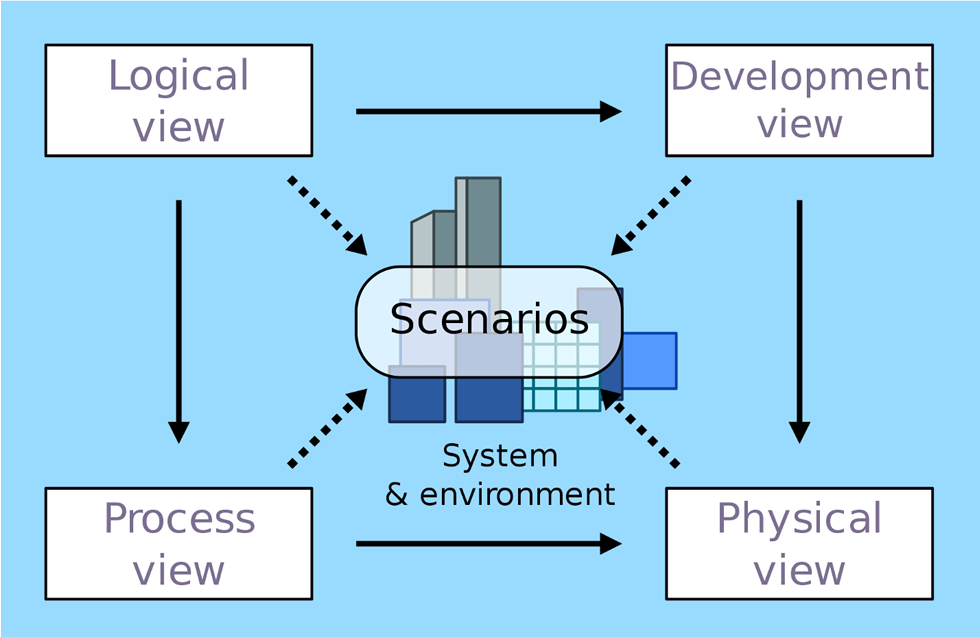
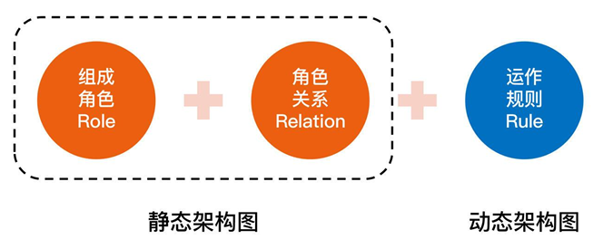
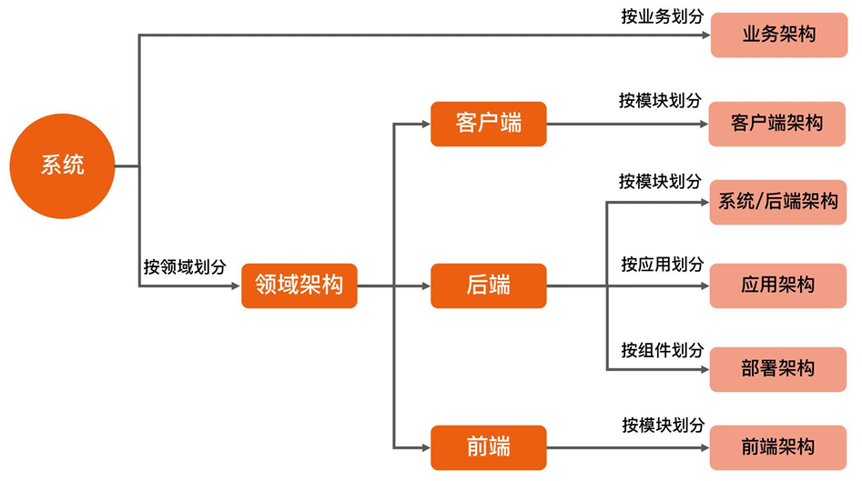

4+1
4+1视图的核心理念是从不同的角度去剖析系统，看看系统的结构是什么样的，具体每个视图
的含义是：
1.
逻辑视图：从终端用户角度看系统提供给用户的
功能，对应 UML的 class 和 state
diagrams。
2.
处理视图：从动态的角度看系统的
diagrams。
3.
处理过程，对应 UML 的 sequence 和 activity
开发视图：从程序员角度看系统的
逻辑组成，对应 UML 的 package diagrams。
4.
物理视图：从系统工程师角度看系统的
物理组成，对应 UML 的 deployment diagrams。
5.
场景视图：从用户角度看系统需要实现的
需求，对应 UML 的 use case diagrams。
（备注：逻辑视图看到的“功能”和场景视图看到的“需求”是一回事吗？答案是否定的。一个需
求可能涉及多个功能，例如“取款”这个场景涉及“插卡”“密码验证”“出钞”等功能；而多个需求可
能涉及同一个功能，例如“取款”和“转账”是两个不同的需求，但是都涉及“密码验证”这个功
能。）
我们可以看到，4+1视图本身很全面也很规范，但是为什么在实际工作中，真正按照这个标准
来画架构图的公司和团队并不多呢？
我认为原因主要有三点：
90/134
1.
架构复杂度增加：1995年的时候，系统大部分还是单体系统，而现在分布式系统越来越
多。如果我们用4+1视图来表示分布式系统的话，就会遇到困难，比如
微服务架构
多的微服务，Development view 就不好表示。
2.
绑定 UML 图：UML 图画架构图存在问题，主要问题是不美观，表达能力弱。

3.
类结构图
理解困难：逻辑视图、开发视图和处理视图比较容易混淆。比如说，有人把逻辑视图理解为
软件开发的
图。
，也有人把处理视图和开发视图等同，还有人认为逻辑视图就是开发视
这些原因导致4+1视图在目前的实际工作中并不是很实用。那么，我们到底要怎么画软件系统
架构图呢？
核心指导思想：4R
架构定义
其实，很多人之所以画不好架构图，最大的痛点就是不好把握到底要画哪些内容，画得太少担
心没有展现关键信息，画得太多又觉得把握不住重点。
所以现在的问题变成了：
应该按照什么样的标准来明确架构图要展现的内容呢？
答案就是我在[第1讲](
01 | 架构到底是指什么？-极客时间)中介绍的4R
架构定义。
软件架构指软件系统的顶层（Rank）结构，它定义了系统由哪些角色（Role）组成，角
色之间的关系（Relation）和运作规则（Rule）。
4R是指4个关键词：Rank，Role，Relation和Rule。既然可以通过4R来定义软件系统的架
构，那么按照4R架构定义的思路来画架构图也是很合情合理的，具体步骤如下：
91/134
第一步，明确Rank：也就是说，不要事无巨细地把一个大系统的方方面面都在一张架构
图中展现出来，而应该明确你要阐述的系统所属的级别（L0～L4），然后只描述这个级
别的架构信息。
第二步，画出Role：从不同的角度来分解系统，看看系统包含哪些角色，角色对应架构
图中的区块、图标和节点等。
第三步，画出Relation：有了角色后，画出角色之间的关系，对应架构图中角色之间的
连接线，不同的连接线可以代表不同的关系。
第四步，最后画出Rule：挑选核心场景，画出系统角色之间如何协作来完成某项具体的
业务功能，对应系统序列图。
我把描述Role和Relation的架构图称为静态架构图，描述Rule的系统序列图称为
动态架构图

从某一个角度去看，静态架构图的数量跟系统复杂度有关，一般是1～2张，如果比较简单，用
一张图就够了，如果比较复杂，就要分别用两张图来展现；而动态架构图是一般是多张，因为
核心场景数量不止一个，对应的系统序列图有多张。

常见架构图
92/134
刚才介绍4+1视图的时候，我提到过，从不同的角度去剖析系统，就会得到不同的视图。其实
按照4R架构定义来画架构图也是这样，用不同的方式去划分系统，就会得到不同类型的架
构，分别对应不同类型的架构图。常见的类型整理如下：

