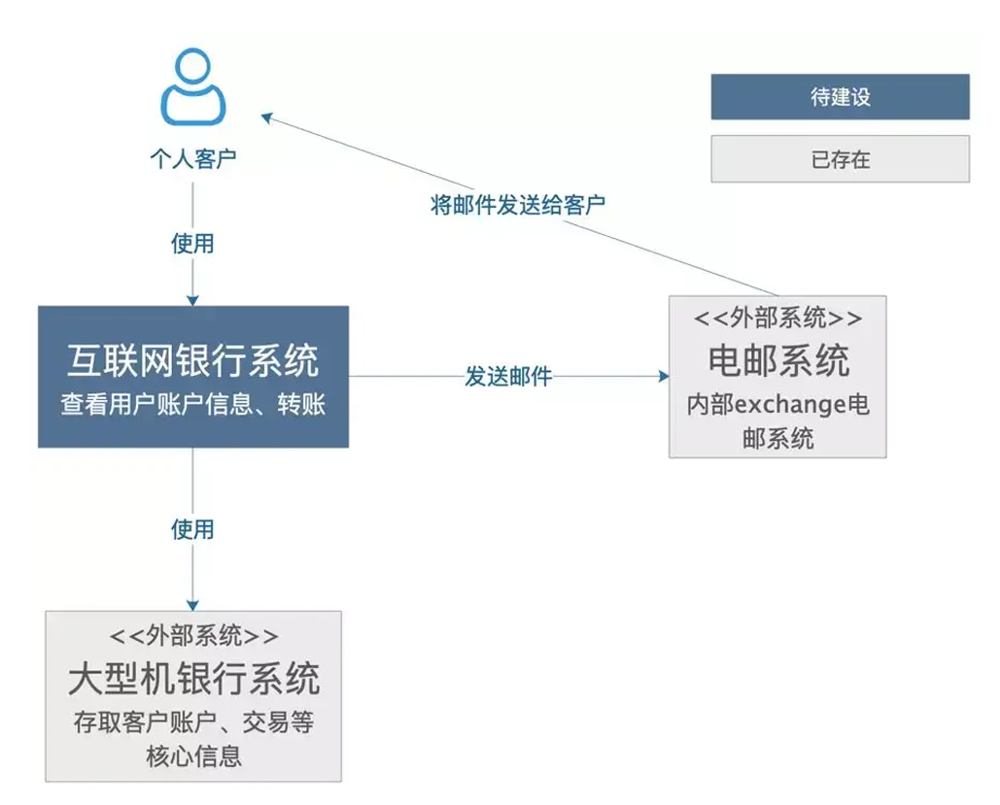
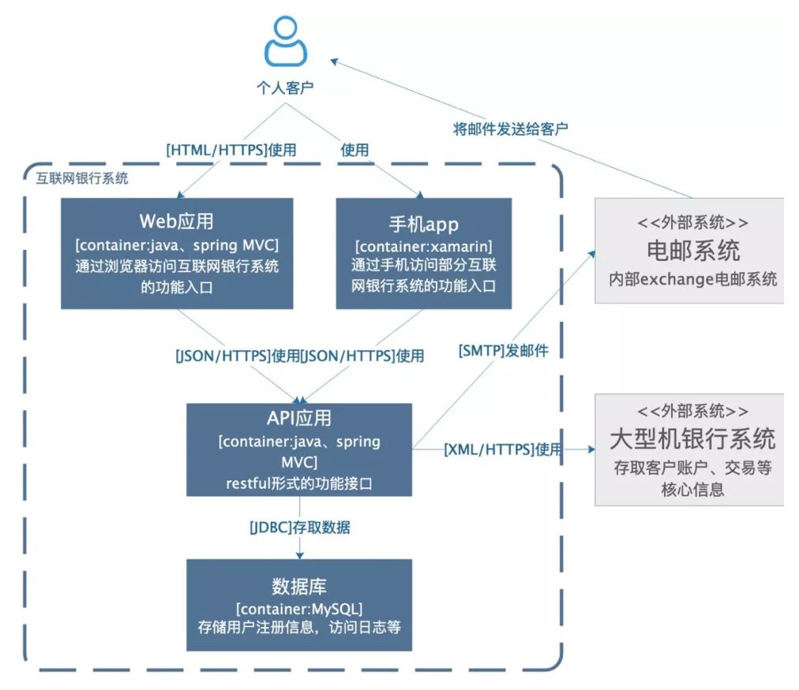
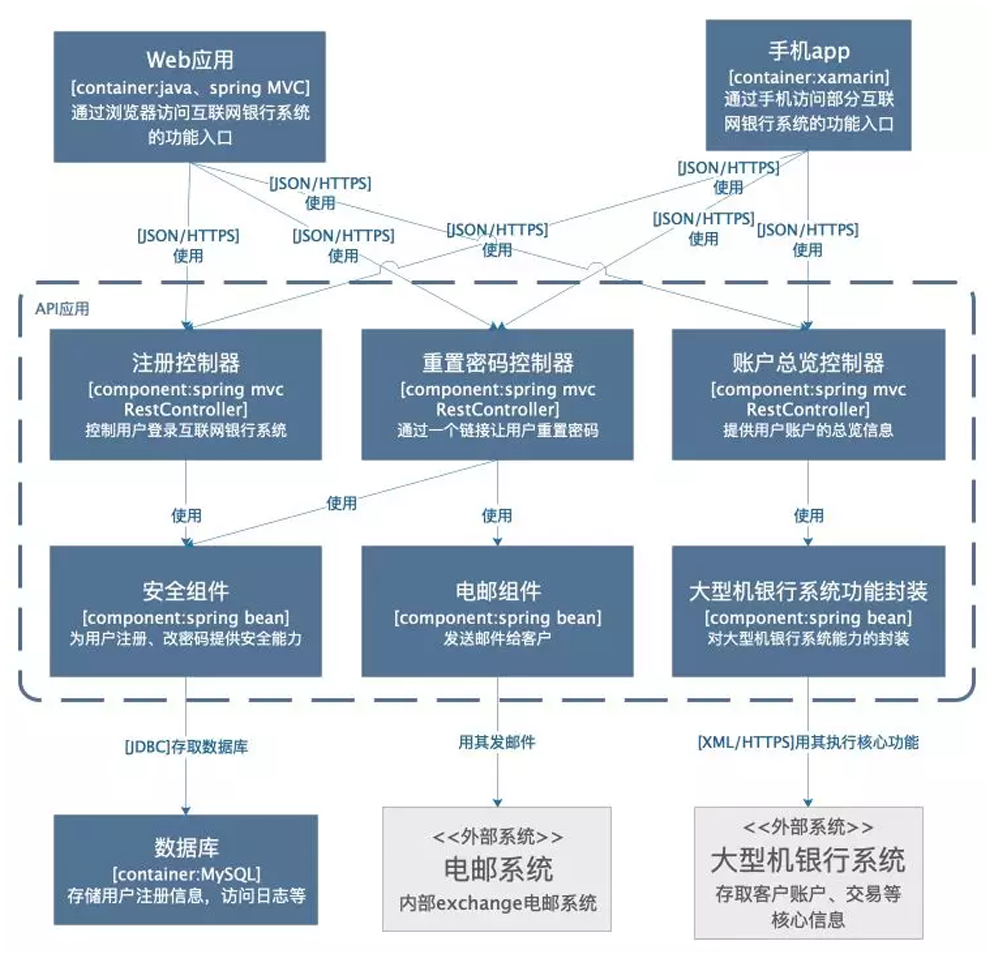
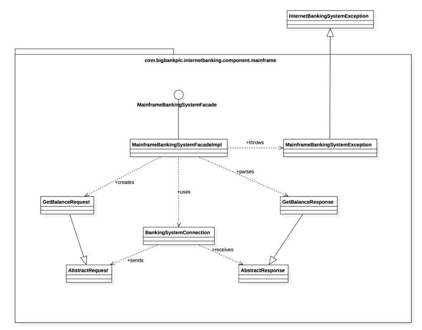
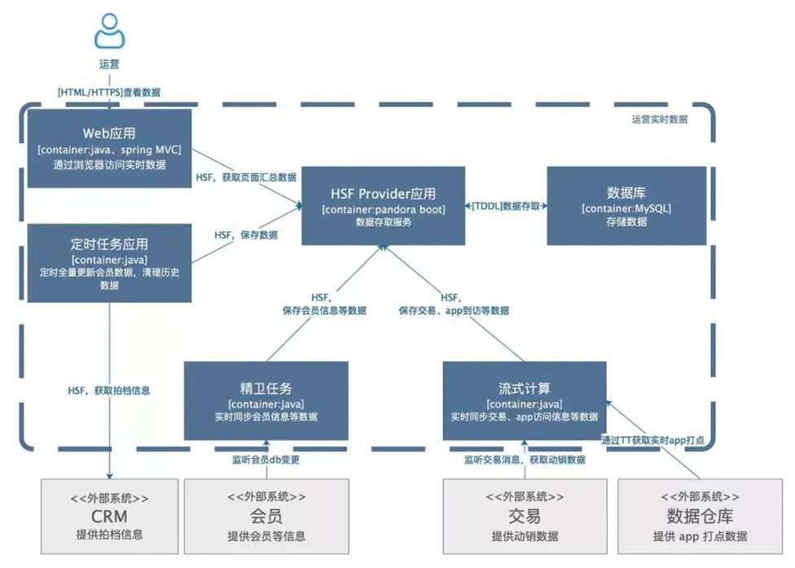

C4: Context, Container, Component, Code/Class

C4 模型使用容器（应用程序、数据存储、微服务等）、组件和代码来描述一个软件系统的静
态结构。这几种图比较容易画，也给出了画图要点，但最关键的是，我们认为，它明确指出了
每种图可能的受众以及意义。
下面的案例来自C4官网，然后加上了一些我们的理解，来看看如何更好的表达软件架构

1、语境图
(System Context Diagram)
62/134
这是一个想象的待建设的互联网银行系统，它使用外部的大型机银行系统存取客户账户、交易
信息，通过外部电邮系统给客户发邮件。可以看到，非常简单、清晰，相信不需要解释，都看
的明白，里面包含了需要建设的系统本身，系统的客户，和这个系统有交互的周边系统。
★ 用途
这样一个简单的图，可以告诉我们，要构建的系统是什么；它的用户是谁，谁会用它，它要如
何融入已有的IT环境。这个图的受众可以是开发团队的内部人员、外部的技术或非技术人员。
即：
构建的系统是什么
谁会用它
如何融入已有的IT环境
★ 怎么画
63/134
中间是自己的系统，周围是用户和其它与之相互作用的系统。这个图的关键就是梳理清楚待建
设系统的用户和高层次的依赖，梳理清楚了画下来只需要几分钟时间。
2
、容器图(Container Diagram)
容器图是把语境图里待建设的系统做了一个展开。

上图中，除了用户和外围系统，要建设的系统包括一个基于java\
spring mvc
的web应用提供
系统的功能入口，基于xamarin架构的手机app提供手机端的功能入口，一个基于java的api应
用提供服务，一个
mysql数据库
用于存储，各个应用之间的交互都在箭头线上写明了。
看这张图的时候，不会去关注到图中是直角方框还是圆角方框，不会关注是实线箭头还是虚线
箭头，甚至箭头的指向也没有引起太多注意。
64/134
我们有许多的画图方式，都对框、线的含义做了定义，这就需要画图的人和看图的人都清晰的
理解这些定义，才能读全图里的信息，而现实是，这往往是非常高的一个要求，所以，很多图
只能看个大概的含义。
★ 用途
这个图的受众可以是团队内部或外部的开发人员，也可以是运维人员。用途可以罗列为：
展现了软件系统的整体形态
体现了高层次的技术决策
系统中的职责是如何分布的，容器间的是如何交互的
告诉开发者在哪里写代码
★ 怎么画
用一个框图来表示，内部可能包括名称、技术选择、职责，以及这些框图之间的交互，如果涉
及外部系统，最好明确边界。
3、组件图(Component Diagram)

组件图是把某个容器进行展开，描述其内部的模块。
★ 用途
这个图主要是给内部开发人员看的，怎么去做代码的组织和构建。其用途有：
描述了系统由哪些组件/服务组成
厘清了组件之间的关系和依赖
为软件开发如何分解交付提供了框架
4、类图(Code/Class Diagram)

这个图很显然是给技术人员看的，比较常见，就不详细介绍了。
案例分享
下面是内部的一个实时数据工具的架构图。作为一个应该自描述的架构图，这里不多做解释
了。如果有看不明白的，那肯定是还画的不够好。

画图方法论
画好架构图可能有许多方法论，本篇主要介绍了C4这种方法，C4的理论也是不断进化的。但
不论是哪种
，我们回到画图初衷，更好的交流，我们在画的过程中不必被条条框
框所限制。简而言之，画之前想好：画图给谁看，看什么，怎么样不解释就看懂。
补充：画图的工具有Keynote、Xmind、EdrawMax、Visio、OmniGraffle、Process On……